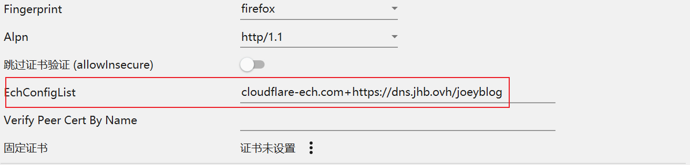

# zdd-argo

### v 0.1.0 2026-06-22

#### 概览

在 Debian / Ubuntu VPS 上生成临时 argo 隧道用于代理

- 支持中文和英文
- 后端：`sing-box` + `cloudflared`
- 临时隧道由 `tmux` 保持，断开 SSH 之后仍可继续运行

#### 要求

- Debian / Ubuntu
- root 权限
- systemd
- amd64 / arm64
- 已安装 curl 或 wget
- 确保 10000 端口未被占用

#### 安装

```bash
curl -fsSL -o zdd-argo.sh https://raw.githubusercontent.com/WhiteMitty/zdd-argo/main/zdd-argo.sh \
  && bash zdd-argo.sh
```

也可用：

```bash
wget -qO zdd-argo.sh https://raw.githubusercontent.com/WhiteMitty/zdd-argo/main/zdd-argo.sh \
  && bash zdd-argo.sh
```

首次运行会自动使用 `saas.sin.fan` 完成安装、创建临时 Argo，

并在最后输出订阅链接，中途无需输入。后续可通过命令唤醒菜单：

```bash
zargo
```

#### 菜单

```text
1. 生成 / 重建临时 Argo
2. 查看当前订阅
3. 更新 sing-box 和 cloudflared
4. 查看运行状态与最近日志
5. 断开当前 Argo 并清理临时缓存
6. 卸载 zdd-argo（保留核心组件）
7. 完整卸载（含脚本专用核心组件）
0. 退出
```

选择更新后，会直接依次更新 `sing-box` 和 `cloudflared`，没有二级菜单。

#### 卸载

运行：

```bash
zargo
```

选择普通卸载或完整卸载后，输入 `yes` 确认；普通卸载保留脚本专用的 `sing-box` 和 `cloudflared`；完整卸载会同时删除它们。

完整卸载仅删除本脚本安装在 /usr/local/lib/zdd-argo/ 中的 sing-box、cloudflared，以及 zdd-argo 自己创建的服务和配置；不会删除或停止由 apt、其他脚本或手动安装的同名程序与服务，也就是说可能出现诸如两个 sing-box 共存但互不干扰的情况。

#### 说明

- 停止或重建隧道后，旧分享链接会失效。

- 优选域名默认使用 saas.sin.fan，可根据情况调整。

- Quick Tunnel 每次重建都可能获得新的 `*.trycloudflare.com` 域名。

- ALPN 固定为 `http/1.1`，用于传统 WebSocket 的 HTTP/1.1 Upgrade 握手。

- 客户端订阅导入后要检查，字段为空时手动填写，以 v2rayN 为例，找到 EchConfigList 字段，完整填入 cloudflare-ech.com+https://dns.jhb.ovh/joeyblog（抄袭自 Joey 佬）。

<br>



<br>

## License

MIT
