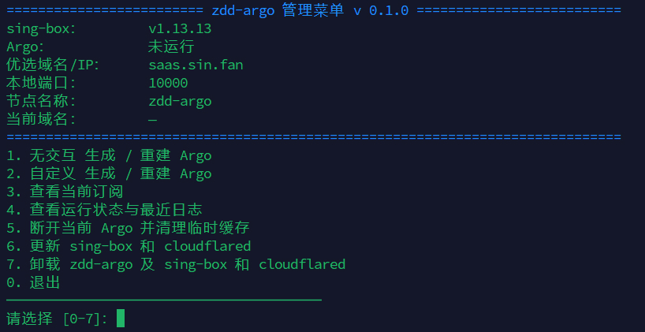
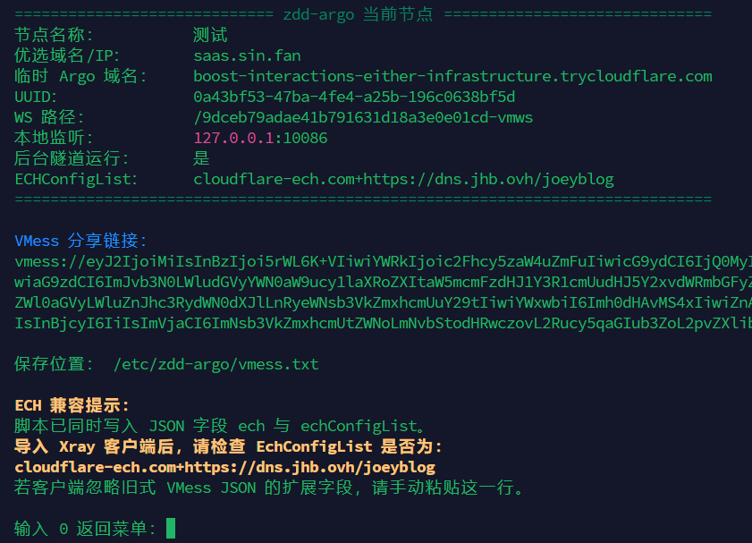

# zdd-argo

### version 0.1.0 
### 2026-06-22

### 概览

- 在 Debian / Ubuntu VPS 上生成临时 argo 隧道用于代理
- 临时隧道由 `tmux` 保持，断开 SSH 之后仍可继续运行
- Quick Tunnel 定位是开发测试，有 200 个并发请求限制，不支持 SSE

### 要求

- Debian / Ubuntu
- root 权限
- systemd
- amd64 / arm64
- 已安装 curl 或 wget
- 确保 10000 端口未被占用或使用自定义模式调整端口

### 安装

```bash
curl -fsSL -o zdd-argo.sh https://raw.githubusercontent.com/WhiteMitty/zdd-argo/main/zdd-argo.sh \
  && bash zdd-argo.sh
```

或者：

```bash
wget -qO zdd-argo.sh https://raw.githubusercontent.com/WhiteMitty/zdd-argo/main/zdd-argo.sh \
  && bash zdd-argo.sh
```

唤醒菜单：

```bash
zargo
```

### 菜单



<br>

### 示例



<br>

### 卸载

运行：

```bash
zargo
```

选择7. 卸载 zdd-argo 及 sing-box 和 cloudflared

完整卸载仅删除本脚本安装在 /usr/local/lib/zdd-argo/ 中的 sing-box、cloudflared，以及 zdd-argo 自己创建的服务和配置；不会删除或停止由 apt、其他脚本或手动安装的同名程序与服务，因此，机器上可能同时存在多个 sing-box 或 cloudflared 实例；只要它们使用不同的服务、配置和监听端口，即可相互独立运行。

### 其他

- 停止或重建隧道后，旧分享链接会失效

- 优选域名默认使用 saas.sin.fan，可根据情况调整

- Quick Tunnel 每次重建都可能获得新的 `*.trycloudflare.com` 域名

- ALPN 固定为 `http/1.1`，用于传统 WebSocket 的 HTTP/1.1 Upgrade 握手
  
- 客户端订阅导入后，字段为空则手动填写，v2rayN 为例，找到 EchConfigList 字段，

- 完整填入 cloudflare-ech.com+https://dns.jhb.ovh/joeyblog （抄袭自 Joey 大佬）

<br>


<br>

### License

MIT
